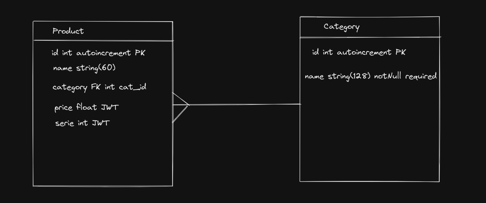

# Desafio IATECAM - Backend

Projeto que propõe fazer um crud simples utilizando python com fastAPI e SQLAlchemy, onde será criado um banco de dados com mariaDB com duas tabelas: products e category. Exemplo de esboço:



## 🚀 Sobre mim
Eu sou uma pessoa desenvolvedora fullstack jr, desenvolvo os meus projetos frontend com HTML, CSS, Javascript e React e no Backend com Node usando o Express e Typescript. Primeira vez codando em python e sempre buscando aprender novas tecnologias.

## Aprendizados

O maior desafio no backend foi fazer a integração com o banco de dados. Fazer a engine do mariaDB funcionar com o banco de dados custou bastante tempo, o tempo era curto então não consegui fazer a integração com o Alembic para construir uma migration, esses foram os desafios encontrados no backend.


## Stack utilizada

**Back-end:** Python, FastAPI e SQLAlchemy.


## Ambiente Virtual

Muitos dos programas instalados durante o projeto foram utilizando a VENV com o python 3.8.10, pip3 e outros programas que auxiliaram a codar como Black e Flake8, caso tenha alguma incompatibilidade verifique se a versão é a mesma que o arquivo backend/.venv.

## Documentação
* Para instalação do [Docker](https://docs.docker.com/desktop/install/windows-install/) em sua máquina
* Para instalação do [Docker Compose](https://docs.docker.com/compose/install/)
* Para ver a imagem utilizada no projeto [MariaDB](https://hub.docker.com/layers/library/mariadb/10.5/images/sha256-1af28af8159cb081f3b2a4f2d8db7fb86b660acd8208269af100645233555161?context=explore)


## Instalação

Instale o meu projeto clonando do o repositório pela chave SSH.

```bash
  $ git clone git@github.com:IanDeSa/desafio-fastAPI-backend.git
```
Entre na pasta do projeto e não esqueça de acionar o ambiente virtual para melhor experiência.
```bash
  $ cd desafio-fastAPI-backend
```
O projeto usa docker-compose, agora suba o container com o docker-compose
```bash
  $ docker-compose up -d
```
O container vai subir um servidor mariadb, para fazer uma conexão as variáveis são: host: localhost, user: root, password: password. Para fins de agilidade com o projeto, o banco de dados deve ser todo executado via query, então logo após subir o servidor e fazer uma nova conexão, é hora de criar o banco de dados que será utilizado neste projeto.

Dentro da pasta local de backend existem dois arquivos importantes, o primeiro é o 'migration.sql' que contém um script sql que pode ser executado via query no seu SGBD que fará a criação do banco e suas tabelas.

O segundo arquivo é opcional, mas caso queira popular o seu banco de dados com alguns exemplos, o arquivo 'seed.sql' pode ser executado via query no seu SGBD.

Agora que o ambiente está pronto, podemos subir o servidor utilizando o uvicorn.
```bash
  $ cd app
  $ uvicorn main:app --reload
```
Tudo feito então agora tudo certo com o seu servidor backend.

## Melhorias

O projeto está em construção, algumas possíveis melhorias são futuras implementações de outras rotas e mais possibilidades de buscas. As querys SQL podem ser melhoradas, fazer um tratamento de erro via middleware, criação de testes unitários e de integração, inclusão de migration via Alembic - SQLAlchemy e entre mais possíveis melhorias.
## Autor

- [@IanDeSa](https://github.com/IanDeSa)


## Feedback

Se você tiver algum feedback, por favor nos deixe saber por meio do email: contato.iansantos@gmail.com
